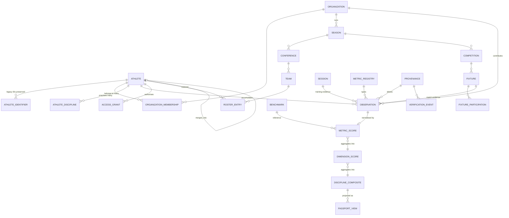

# Athlytica — Data Architecture Audit

**Phase:** Audit & design only. No production change was made.
**Date:** 2026-08-12
**Scope:** Supabase project `qxfrypvevjsyzkquewxh`, the `athlytica-systems-engine`
repository, and the legacy CSV corpus.

Every claim is tagged:

- **OBSERVED** — read directly from the live database, the repository, or a source file.
- **INFERENCE** — derived by reasoning over observed data; stated with its evidence.
- **UNKNOWN** — could not be determined from available material.

---

## 1. Executive summary

The single most important finding is that **there is no production athlete data
to migrate.** `public.athlete` holds 13 rows: seven identical `Test Athlete`
records and six TTA football demo seeds. `nrhl_athlete`, `bigice_athlete`,
`nrhl_scrimmage`, `nrhl_stat_line`, `nrhl_metric`, `workspace_roles` and
`user_profiles` are all **empty**. (OBSERVED)

This is good news, and it changes the risk calculus completely. The dangerous
migration — rewriting live athlete history — is not the migration in front of
you. The migration in front of you is a **first load** from CSV into a schema
that has never held real data. Get the target model right now and there is
nothing to undo later.

The second finding is that the schema has already been built **three times**,
and all three versions are live simultaneously:

| Model | Root table | Rows | Character |
|---|---|---|---|
| A — Passport/provenance | `public.athlete` | 13 | Rich, provenance-first, FIFA-flavoured |
| B — Tenant/telemetry | `public.athletes` → `users` → `tenants` | 6 | Scoring engine, RLS by tenant |
| C — `athlytica_core` | `athlytica_core.athletes` | 0 | Parent-first, **RLS disabled** |

Plus two per-venture mirrors (`nrhl_athlete`, `bigice_athlete`) keyed by text
codes, both empty. **Five tables can claim to be "the athlete".** (OBSERVED)

The third finding is the most consequential for the North Star. The legacy
corpus **has already collapsed the raw → derived layers the brief forbids
collapsing**, and the collapse is provably lossy:

- `Technical precision` is not a measurement. It is exactly `4 − 2 × Technical_Breaks`,
  confirmed on **265 of 265 rows with zero mismatches**. It carries no
  information the raw break count does not. (OBSERVED)
- That derived value was then averaged into `Avg Tech Precision`, exported as
  `technical_rating`, and lands in a column called *rating* where **more negative
  means better**. Any dashboard sorting `technical_rating DESC` ranks the worst
  athletes first. (OBSERVED)
- `total_points` is not goals + assists. It is `3×assisted + 1×unassisted +
  1×assists` — a deliberate coaching incentive for unselfish play. Noel Inoue:
  124 points, not 58. The published CSV **destroyed the assisted/unassisted
  split** that the formula needs. (OBSERVED)

Finally, identity is genuinely broken in the source data, in ways that must not
be auto-resolved: **209 athlete IDs, 13 IDs bound to more than one human, 15
humans holding more than one ID, 101 single-word names, and 1,041 dates whose
day/month order is mathematically undecidable.** (OBSERVED)

**This system is not ready for migration.** Sections 27 and 28 list what must be
decided first.

---

## 2. Current architecture

```
Next.js 16 App Router (Vercel, deploys from `main`)
  ├── app/(app)/dashboard/**        workspace shell, 4 hardcoded ventures
  ├── app/api/v1/**                 27 route handlers
  ├── app/register, /onboarding     M-Pesa intake + profile claim
  └── components/workspace/*        per-venture dashboards (inline styles)

Supabase (qxfrypvevjsyzkquewxh)
  ├── public                        56 tables + 3 views
  ├── athlytica_core                4 tables, RLS OFF
  └── functions/                    metric-ingest, telemetry-processor

Convex (bright-marmot-447)          mirror via lib/sync/convexSyncQueue
Prisma schema                       present, not the migration path
```

Session state lives in **localStorage**, not cookies, so the auth guard is
necessarily client-side (`WorkspaceProvider`). There is deliberately no
`middleware.ts`. (OBSERVED — documented in `CLAUDE.md` and confirmed in
`utils/supabaseClient.ts`.)

---

## 3. Current Supabase schema

60 tables across two schemas. Grouped by which of the three models they serve:

**Model A — passport / provenance (`public.athlete` root)**
`athlete`, `sport_profile`, `metric_value`, `metric_registry`, `sport_taxonomy`,
`discipline_taxonomy`, `provenance`, `performance_record`, `competition_event`,
`biometric_record`, `injury_record`, `custody_record`, `transfer_event`,
`representation_claim`, `agency`, `agent`, `club`, `federation`,
`guardian_contact`, `audit_log`, `division`, `division_scoring_rule`,
`athlete_sports`, `athlete_coaches`, `athlete_metrics_log`.

**Model B — tenant / telemetry (`public.athletes` root)**
`athletes`, `users`, `tenants`, `venues`, `sessions`, `performance_logs`,
`telemetry_ingest_queue`, `scouting_metric_log`, `athlete_tenant_links`,
`cohort_telemetry`.

**Model C — `athlytica_core`**
`athletes`, `parents`, `performance_logs`, `scalable_id_sequence`.

**Per-venture mirrors** `nrhl_athlete`, `nrhl_scrimmage`, `nrhl_stat_line`,
`nrhl_metric`, `bigice_athlete`, `bigice_enrollment`, `bigice_document`.

**Commerce / ops** `registrations`, `payment_events`, `gate_states`,
`commercial_price_tier`, `commercial_inventory`, `digital_product_ledger`,
`cohort_session_registry`, `google_form_submission_log`, `admissions_intakes`,
`onboarding_funnel_events`, `sync_dead_letter_queue`.

**Access control** `workspace_roles`, `user_profiles`.

**Views** `actuarial_injury_exposure_summary`, `bone_age_dispute_evidence`,
`solidarity_claim_input`.

16 enums exist, including a well-formed `verification_status`
(`unverified | pending | verified | disputed | revoked`) and
`data_source_type` (9 values). (OBSERVED)

### What is genuinely good

- **`provenance` is a first-class table**, referenced by FK from 10 tables. It
  carries `entered_at`, `verified_at`, `verified_by_actor_id`,
  `verification_method`, `verification_status`, `confidence_score`,
  `source_document_hash`, `witness_ids`. This is the right shape.
- **`payment_events` and `performance_logs` are append-only**, enforced by
  `BEFORE UPDATE OR DELETE` triggers that raise. Real immutability, not a
  convention. (OBSERVED)
- **`audit_log` has a hash chain** (`prev_event_hash` → `event_hash`).
- `metric_value` allows numeric / text / boolean values against a FK'd
  `metric_registry`, with a `context` CHECK
  (`in_competition | combine_test | training_session | medical_exam`).
- `division_scoring_rule` stores weights **as data in a `points` jsonb**, with a
  CHECK that the right keys exist per `rule_type`. That is the correct
  instinct for explainable scoring.

### What is structurally dangerous

See §25. The headline items: three athlete roots, a shared ID sequence that
will collide with legacy codes, no `observed_at` on the raw metric path, and
`athlytica_core` with RLS disabled.

---

## 4. Current authentication / role architecture

- Supabase Auth, magic link + password, single callback at `/auth/callback`.
- `workspace_roles(user_id, workspace, role)` — roles are
  `GLOBAL_FOUNDER | HEAD_COACH | ATHLETE`, workspaces are
  `nrhl | big_ice | athlytica_hq | tta`. **0 rows.** (OBSERVED)
- `user_profiles.requested_workspace` / `requested_role` is a *claim*, not a
  grant. Roles offered at onboarding: `ATHLETE | PARENT | COACH | SCOUT`.
- `is_global_founder()` hardcodes `dennis@bigice.co.ke` in SQL;
  `config/workspaces.ts` hardcodes the same address in TypeScript. Both must
  change together. (OBSERVED)

**Note on the brief's onboarding list.** The brief describes account types
*Club / League, School / Academic Program, Private Coach, Parent / Athlete
Profile, Scout / Recruiter*. What is implemented is 4 **roles** × 4 hardcoded
**workspaces**. There is no organization-*type* concept and no generic
organization entity — `workspace` is a CHECK-constrained enum of four named
ventures. Nothing has been removed; the concept was never modelled. Adding a
fifth organization today requires a migration plus edits in
`config/workspaces.ts`. (OBSERVED)

---

## 5. Current organization architecture

Three incompatible tenancy mechanisms coexist:

1. **`tenants` table + `athlete_tenant_links`** — 1 tenant row (TTA), proper FK.
2. **`workspace` text enum** on `workspace_roles` / `user_profiles` — not a FK,
   no table.
3. **`venture_context` text CHECK** on `registrations`
   (`NRHL | BIG_ICE | ATHLYTICA`) — a third vocabulary, and note it lacks TTA.

These do not reference each other. A workspace is not a tenant is not a venture.
(OBSERVED)

RLS uses two different tenant resolvers:
`app_tenant_id()` reads `current_setting('app.current_tenant_id')` (a session
GUC, `{public}` role), while `jwt_tenant_ids()` resolves via the `users` table
by email or uid (`{authenticated}` role). Tables carry **both** policies —
`performance_logs`, `registrations`, `venues` each have a `tenant_isolation_policy`
and a `tenant_member_policy`. Postgres ORs permissive policies together, so the
effective grant is the union. (OBSERVED)

---

## 6. Current athlete identity architecture

**Four ID formats are generated by live code, and they disagree.** (OBSERVED)

| Producer | Format | Example | Location |
|---|---|---|---|
| `athlytica_core.generate_scalable_athlete_code()` | `ATH-NNNNN` | `ATH-00501` | trigger on `athlytica_core.athletes` |
| `nrhl_next_athlete_code()` | `ATH-NNNNN` | `ATH-00501` | SQL function |
| `bigice_next_athlete_code()` | `BIIF-YYYY-NNNN` | `BIIF-2026-0001` | SQL function |
| `scripts/normalize-legacy-ids.js` | `ATH-YYYY-NNNN` | `ATH-2025-0020` | declared "the canonical serialization" |
| `lib/services/nrhl-etl.ts` `migrateLegacyCode()` | `ATH-NNNNN` | `ATH-00047` | *"Legacy ids are 3-digit, the target is 5"* |

`normalize-legacy-ids.js` **encodes the registration year into the permanent
ID**, which directly violates the brief's requirement that the ID not depend on
year. `lib/converters/convexAdapter.ts` throws an error instructing you to run
that script. The two in-repo definitions of canonical are mutually exclusive.
(OBSERVED)

The brief states the current format is `ATH-KE-2024-0047`. **That format appears
nowhere** — not in the database, not in the code, not in the CSVs. The formats
actually present are `ATH-NNN` (legacy source) and the five above. (OBSERVED)

### The sequence collision

`athlytica_core.scalable_id_sequence.current_value = 500`. All three SQL
generators increment **this same row**, so `ATH-`, `BIIF-` and NRHL codes draw
from one interleaved counter — the numeric space is shared and gapped by design.
(OBSERVED)

Worse: legacy athlete IDs in the CSV corpus **run from `ATH-001` to `ATH-638`**.
The sequence will issue `ATH-00501` … `ATH-00638`, whose numeric parts are
already taken by real, distinct legacy humans (`ATH-500` Jason Jabali,
`ATH-537` Elaine, `ATH-566` Shaya Das, …). The strings differ by zero-padding
only. **This is a live landmine**: any human or script that strips padding will
merge unrelated athletes. (OBSERVED — max legacy ID 638 measured across all 15
RAW files.)

### Claim tokens

`generate_legacy_claim_token()` fires `BEFORE INSERT` on `public.athlete` and
mints `PLAY-<FIRSTNAME>-<4 hex>` for legacy rows. It loops until unique and
falls back to `ATHLETE` for empty names. This is sound, and is the only working
identity mechanism currently in production. Note it **leaks the athlete's first
name into a shareable token**. (OBSERVED)

---

## 7. Current metric architecture

Metrics are stored in **five unrelated places**: (OBSERVED)

| Table | Shape | Rows | Has `observed_at`? |
|---|---|---|---|
| `metric_value` | code + numeric/text/bool, FK `metric_registry`, FK `provenance` | 44 | **yes** (`measured_at`) |
| `athlete_metrics_log` | code + free `metric_payload` jsonb + `metric_version` | 62 | **yes** (`metric_timestamp`) |
| `performance_logs` | 5 fixed float columns + composite | 24 | **no** — `created_at` only |
| `scouting_metric_log` | code + float + text context | 0 | partial (`logged_at`) |
| `nrhl_metric` | code + value + unit + scale + pillar | 0 | `captured_at` + `capture_confidence` |

`metric_registry` holds **14 metrics, all `sport_code = 'football'`** — seeded
by the TTA demo. There is **not one skating, inline-hockey or ice-hockey metric
registered**, despite those being the two reference organizations. (OBSERVED)

`sport_taxonomy` has 2 rows (`ice_hockey`, `football`). `discipline_taxonomy`
has 1 row (`football / eleven_a_side`). **Inline hockey, figure skating, slalom,
street and inline skating are absent from the taxonomy entirely.** (OBSERVED)

`nrhl_metric.pillar` is CHECK-constrained to
`Speed | Agility | Stamina | Technical Skill | Cognitive/Tactical` — five
pillars, matching the engine's five vectors but **not** the ten performance
dimensions the brief proposes.

---

## 8. Current scoring architecture

`supabase/functions/_shared/analyticsEngine.ts` (482 lines) is the best-built
component in the system. (OBSERVED)

It is genuinely good:

- `ENGINE_VERSION = "1.0.0"`, stamped onto every `performance_logs` row.
- Emits **per-vector `confidence` in [0,1]** alongside the five vectors, with an
  explicit contract: *"Vectors with zero evidence return the neutral prior (50)
  with confidence 0 — downstream consumers MUST weight by confidence, never
  treat 50 as measured."*
- The composite is a **confidence-weighted mean**, so a speed-only stream does
  not get diluted by four neutral priors.
- Real methods, not hand-waving: Banister TRIMP for stamina, 95th-percentile
  velocity for speed, Shannon occupancy entropy for tactical positioning,
  ray-casting point-in-polygon for the venue gate.

Three real problems:

1. **`DEFAULT_BANDS` is a single hardcoded global benchmark.** Six floor/elite
   pairs, described in a comment as *"calibrated for skating-family sports"*,
   with **no cited source, no version, no age band, no sex band, no discipline
   split**. `calculateTaxonomyVectors` accepts a `bands` override, but nothing
   in the codebase ever passes one, and there is no benchmark table. A U8
   beginner and a U16 advanced athlete are scored against identical anchors.
   (OBSERVED)
2. **Confidence is persisted, but not queryably.** `telemetry-processor`
   writes it into `raw_payload.confidence` jsonb. `performance_logs` has no
   confidence column and no jsonb index on that path. So the contract's
   "MUST weight by confidence" cannot be honoured by a SQL dashboard without an
   unindexed jsonb extraction — and a stored `50` is indistinguishable from a
   measured `50` at a glance. (OBSERVED)
3. **`performance_logs` has no `observed_at`.** Only `created_at DEFAULT now()`.
   The session date is reachable via `session_id → sessions.start_time`, but
   `sessions.start_time` itself defaults to `now()`. Backdated legacy load would
   record the import date as the observation date. (OBSERVED)

Two further scoring formulas live in `lib/services/nrhl-etl.ts`, versioned in
code but **not stored with any row**:

```ts
NRHL_POINT_FORMULA   = { assisted: 3, solo: 1, assist: 1 }
POINT_FORMULA_VERSION     = "NRHL-PTS-v1"
COMPOSITE_FORMULA_VERSION = "NRHL-COMP-v1"
```

Nothing in the database records which formula version produced a stored value.
`nrhl_metric.formula_version` exists as a column but the table is empty.
(OBSERVED)

---

## 9. Current verification architecture

Correctly separated from performance — the brief's concern is already respected.
(OBSERVED)

- `provenance.verification_status` :: `unverified | pending | verified | disputed | revoked`
- `provenance.verification_method` :: 7 values incl. `government_id_check`
- `provenance.confidence_score` numeric CHECK 0..1
- `performance_logs.venue_verified` boolean, set by the geospatial gate
  (`insideRatio(points, polygon) >= 0.95`, enforced at the API layer)
- `athlytica_core.performance_logs.venue_trust_layer` boolean + `verification_status`

Two gaps:

- `nrhl_metric.capture_confidence` (0–2) is **date-parse confidence**, not
  measurement confidence — same word, different concept, and it sits next to a
  metric value. Genuinely confusable. (OBSERVED)
- The engine's per-vector evidence `confidence` and provenance's
  `confidence_score` are different quantities with near-identical names.

---

## 10. Legacy data inventory

The named datasets are **not in the repository**. They are in
`C:\Users\User Profile\Downloads` as Google Sheets tab exports. The repo's
`core-engine/schemas/seed/nrhl_legacy/` contains only two small derived
extracts. (OBSERVED)

**15 `RAW DATA INPUT` files spanning 2020–2026** — note the brief says 2020–2023;
2024, 2025 and 2026 also exist. (OBSERVED)

| Year | File | Data rows |
|---|---|---|
| 2020 | `RAW DATA INPUT 2020.csv` | 92 |
| 2020 | `RAW DATA INPUT 2020(1).csv` | 92 |
| 2021 | `RAW DATA INPUT 2021.csv` | 93 |
| 2021 | **`RAW DATA INPUT 2021(1).csv`** | **1,020** |
| 2022 | `RAW DATA INPUT 2022.csv` | 222 |
| 2023 | `RAW DATA INPUT 2023.csv` | 482 |
| 2024 | `RAW DATA INPUT 2024.csv` | 308 |
| 2025 | `RAW DATA INPUT 2025.csv` | 480 |
| 2025 | `RAW DATA INPUT 2025(1).csv` | 480 |
| 2026 | `RAW DATA INPUT 2026.csv` | 282 |
| 2026 | `RAW DATA INPUT 2026(1).csv` | 327 |
| 2026 | `RAW DATA INPUT 2026(2).csv` | 327 |
| 2026 | `RAW DATA INPUT 2026(3).csv` | 327 |
| 2026 | `RAW DATA INPUT 2026(4).csv` | 342 |
| 2026 | **`RAW DATA INPUT 2026(5).csv`** | **492** |

**The `(n)` copies are not backups.** `2021.csv` has 93 rows; `2021(1).csv` has
1,020 — an 11× difference. All six 2026 variants differ in both size and MD5.
`Athlete Progress.csv` and `Athlete Progress(1).csv` are **byte-identical in
size (2,189) but differ in MD5**. There is no marker of which is authoritative.
(OBSERVED)

Only two pairs are provably identical: `Group sessions` and `Scrimmage Tracker`.

**Supporting datasets**

| File | Rows | Content |
|---|---|---|
| `Athlete Progress.csv` | 17 | Per-athlete rollup, `ATH-NNN` IDs, `Avg Tech Precision`, `Drill Pass Rate`, `Total Session Load` |
| `Group sessions.csv` | 11 | 2026 curriculum plan — phases, drills, skills. Narrative, not measurement. |
| `Outsourced.csv` | 77 | Institution bookings 2021→. Two columns: date, institution. |
| `Dashboard.csv` | 26 | Rendered spreadsheet dashboard. Presentation artefact. |
| `Scrimmage Tracker.csv` | 157 | Match log + cumulative stats. **The NRHL source of truth.** |

**In-repo extracts** (`core-engine/schemas/seed/nrhl_legacy/`)
`athlete_individual_stats.csv` (31 athletes) and `legacy_scrimmages.csv` (10
scrimmages) — both **derived from `Scrimmage Tracker.csv`, with provenance
lost**. See §11.

**Not on disk / UNKNOWN:** the brief names a `RAW DATA INPUT 2019` equivalent and
"existing documents/forms describing baseline and scouting concepts". A
`Baseline capture sheet- Riverside.pdf` exists in
`Desktop\NRHL\Baseline Capture Sheets\` but was not parsed in this pass.

### Canonical set selected for the counts in this report

Richest copy per year, **provisionally** — this needs founder confirmation
(Decision D-4):

`2020.csv`, `2021(1).csv`, `2022.csv`, `2023.csv`, `2024.csv`, `2025.csv`,
`2026(5).csv` → **3,096 session rows, 209 distinct athlete IDs, 1,364 distinct
session IDs.** (OBSERVED)

---

## 11. Legacy data quality report

Full register with IDs and severities: **`docs/ATHLYTICA_DATA_QUALITY_ISSUES.md`**.
Headline measurements:

### Schema drift across years (OBSERVED)

The column set changes every year. Examples:

- 2020 header contains `Athlete_ID ` — **with a trailing space**.
- 2020 has no `Latitude`/`Longitude`; 2022 adds them.
- 2022 spells the column `Low_Center_of\_Gravity` — **with a literal backslash**.
- 2020 uses `Low Center of Gravity` (spaces), 2026 uses `Low Center of Gravity (Check)`.
- `Passed_Determinant_Drill` is `TRUE`/`FALSE` in 2020, `YES`/`NO` in 2022.
- 2026 restructures wholesale: adds `Raw Time(10m dash)`, `Speed score`,
  `Power Score`, `Technical precision`; embeds the grade scale in the header
  (`Coach_Grade(1=Poor, 2=Devoloping, …)` — *sic*).

### Spreadsheet errors written into data (OBSERVED)

| Token | Occurrences | Where |
|---|---|---|
| `#REF!` | 984 | 2022 `Session_Load` and later |
| `#VALUE!` | 48 | 2026 `Longitude` |
| `#N/A` | 3 | 2022, 2023, 2024 |
| `°` inside a coordinate | 1,754 | 2026 (`36.965000°`) |

`Session_Load` is `#REF!` for **every row of 2022** — the entire year's training
load is a broken formula reference.

### Free text in numeric fields (OBSERVED)

`Raw Time(10m dash)` = `"Didn't manage to take the speed"`. This is the correct
*behaviour* by a coach (do not invent a number) recorded in the wrong *place*.
The target schema must have a first-class "attempted, not recorded" state.

### Dates (OBSERVED)

| Shape | Count |
|---|---|
| `DD/MM/YYYY` or `MM/DD/YYYY` — ambiguous | 2,393 |
| `YYYY-MM-DD` ISO | 480 |
| `DD-MM-YYYY` | 58 |
| `D/M/YYYY` unpadded — ambiguous | 52 |
| Unparseable | 4 |
| Missing | 109 |

**1,041 of 2,503 slash-dates have both parts ≤ 12 and are therefore
undecidable from the value alone** — 41.6%. The `Scrimmage Tracker` proves the
convention *changes mid-file*: `03/01/2026`, `10/01/2026`, `17/01/2026` are
day-first (confirmed against `legacy_scrimmages.csv`), then `1/24/2026`,
`1/31/2026`, `2/7/2026` are month-first.

Four impossible dates: `1303/2022`, `31/10/203`, `23/02024`, `19/12/24`.

`lib/services/nrhl-etl.ts` already implements a 3-level date-confidence model
(`0|1|2`) that handles exactly this. It is the right primitive and should be
reused, not rebuilt.

### Vocabulary fragmentation (OBSERVED)

**20 spellings of discipline for roughly 8 real disciplines:**

```
Foundational Skating      1669   Roller Hockey              112
Inline / Roller Hockey    1089   Urban / Freestyle           88
Inline Skating             812   Pylometrics                 60   <- misspelling
Figure Skating             340   Inline Hockey               54
Ice Hockey                 227   Ice Skating Foundational    21
Basic Ice Skating          208   Slalom                      12
Inline skating             172   Dryland workout             11   <- vs "workouts" 8
Ice Foundation             169   Pylometrics & Agility       11
Strength & Conditioning    116   Off ice conditioning         6
                                 Speed Skating                4
```

`Inline / Roller Hockey`, `Roller Hockey` and `Inline Hockey` are almost
certainly one discipline (1,255 rows). `Basic Ice Skating` / `Ice Foundation` /
`Ice Skating Foundational` are almost certainly one (398 rows).
**`Foundational Skating` (1,669 rows — the single largest) does not say whether
it is ice or inline.** That is unresolvable from the column alone.

**10 spellings of age group for 4 bands:**

```
U8 (Under 8 years)  1858    U16(13-16years)      37
U8(Under 8 years)   1080    Over 16              23
U12(9-12years)       974    U16 (13+ years)      22
U12 (9–12 years)     898    U16 (13-16 years)    14
U12 (9-12 years)     282    Over16                1
```

Note `U12 (9–12 years)` uses an **en-dash**, the others a hyphen. And
`U16 (13+ years)` is **semantically different** from `U16 (13-16 years)` — one
is unbounded. Not a pure whitespace fix.

`Student_Level` is the one clean vocabulary: exactly
`Beginner | Novice | Intermediate | Advanced`. (OBSERVED)

### Derived values presented as measurements (OBSERVED — the critical class)

**`Technical precision = 4 − 2 × Technical_Breaks`. 265/265 rows match, 0
mismatches.** Observed pairs: `(0,4) (1,2) (2,0) (3,−2) (4,−4)`.

Consequences, all confirmed:

- `Technical precision` is 100% redundant with the raw break count.
- Its per-athlete mean became `Avg Tech Precision` in `Athlete Progress.csv`
  (Raimi −0.3, Malakai −0.7, Shaya −1.1).
- That became `technical_rating` in `athlete_individual_stats.csv`
  (Raimi −0.387, Malakai −0.667, Shaya −1.111).
- The DB column `nrhl_athlete.technical_rating numeric` is where it lands.
- **Sign is inverted relative to the name.** Top scorers hold the most negative
  values (Noel −1.667, Dakota −2.0, Lavrin −2.0); the weakest athlete holds the
  most positive (Leroy Sila +2.4, alongside 40% attendance and speed 1.6).

Also note the rounding disagrees: `−0.387` should display as `−0.4`, but
`Athlete Progress` shows `−0.3`. The two rollups were computed over different
windows or by different code. UNKNOWN which is correct.

**`total_points` is a coaching-incentive score, not a hockey stat.**
Reverse-engineered from the 31-athlete CSV and then confirmed against
`lib/services/nrhl-etl.ts`:

```
points = 3 × assisted_goals  +  1 × unassisted_goals  +  1 × assists
```

All 31 athletes solve with integer, in-range splits. The `Group sessions.csv`
Week-1 curriculum states the intent in plain English: *"Unselfish play (3pts for
assist goals)"*. The repo encodes it as
`NRHL_POINT_FORMULA = { assisted: 3, solo: 1, assist: 1 }`.

**The published extract destroyed the input.** `athlete_individual_stats.csv`
has a single `goals` column. The formula needs assisted vs unassisted
separately. The split is recoverable only by solving `2a = p − a_ssists − g`
per athlete — which works here **only because every athlete happens to have a
unique solution.** It is arithmetic reconstruction, not data. `nrhl_stat_line`
correctly has both `assisted_goals` and `solo_goals`; the CSV pipeline collapsed
them.

Worked example — Noel Inoue: `g=35, a=23, p=124` → `assisted=33, unassisted=2`.
Naive goals+assists would read **58**. The stored figure is **124**. A dashboard
that recomputes "points" the standard way would silently halve every athlete.

### Empty measurement columns (OBSERVED)

In `Athlete Progress.csv`, `Low COG %`, `Full Extension %` and
`Perfect Recovery %` are **`0%` for every athlete**. These are the three
Technical Compliance components. The columns exist; the data does not. They
must not be migrated as measured zeros.

`penalty_minutes` is empty for all 31 athletes in `athlete_individual_stats.csv`.

---

## 12. Athlete identity reconciliation report

**209 distinct athlete IDs**, formats `ATH-NNN` (207) and `ATL-NNN` (2 — typo).
Numeric range **1 → 638**. (OBSERVED)

### Class 1 — one ID, two different humans (CRITICAL, do not merge)

| ID | Name A | Name B | Assessment |
|---|---|---|---|
| `ATH-047` | Sam Inoue | Shirley Makena | **confirmed_different** — already handled in `LEGACY_ID_COLLISIONS` |
| `ATH-546` | Jasmine Kariuki | Liam Pashani | **confirmed_different** |
| `ATH-013` | Nathan Mulani | Scooter Araka | **confirmed_different** |
| `ATH-540` | Jabir | Mugeshi Mwangi | **probable_different** |
| `ATH-541` | Amina | Zuri | **probable_different** |
| `ATH-542` | Iman | Shannon | **probable_different** |
| `ATH-620` | Johari Keige | Tyler | **unresolved** |
| `ATH-014` | Sofia Araka | Sofia Mulani | **unresolved** — same given name, and note `ATH-013` pairs a *Mulani* with an *Araka* too |

`ATH-014` is genuinely hard. It could be one girl whose recorded surname was
corrected, or two cousins. The `ATH-013` pattern suggests a systematic
Mulani↔Araka confusion in one intake batch. **Human review required.**

### Class 2 — one ID, spelling variants of one human (safe after review)

`ATH-053` Jaydan/Jayden Morara · `ATH-500` Jason/Jayson Jabali ·
`ATH-513` Ethan Gichohi/Gichohu · `ATH-554` Ethan Verspech/Verspecht ·
`ATH-556` Lisa Verspech/Verspecht → **probable_same_athlete**.

### Class 3 — one human, two IDs (CRITICAL — duplicate athlete records)

| Name | IDs | Note |
|---|---|---|
| Shaya Das | `ATH-006`, `ATH-566` | |
| Eli Das | `ATH-009`, `ATH-567` | |
| Keila Naitore | `ATH-025`, `ATH-568` | |
| Lavrin Dickens | `ATH-064`, `ATH-569` | |
| Ruby Atsango | `ATH-029`, `ATH-544` | |
| Jasmine Kariuki | `ATH-048`, `ATH-546` | also in Class 1 |
| Maya Aridi | `ATH-049`, `ATH-557` | |
| Sam Inoue | `ATH-041`, `ATH-047` | also in Class 1 |
| Shirley Makena | `ATH-047`, `ATH-598` | also in Class 1 |
| Johari Keige | `ATH-597`, `ATH-620` | also in Class 1 |
| Fiona | `ATH-019`, `ATH-622` | one-word name |
| Tum Tum | `ATH-036`, `ATH-623` | |
| Leon Sila | `ATH-020`, `ATL-020` | prefix typo |
| Moyo | `ATH-509`, `ATL-509` | prefix typo |
| ` Kids Group` | `ATH-030`, `ATH-055` | **not a person** |

**`ATH-566/567/568/569` are consecutive and map to `ATH-006/009/025/064`.**
That is not coincidence — it is the signature of a **bulk re-registration
event** in which an existing cohort was re-issued new IDs without retiring the
old ones. INFERENCE, but strongly evidenced by the consecutive run.

Note the knot around `ATH-047`: Sam Inoue holds `ATH-041` **and** `ATH-047`,
while Shirley Makena holds `ATH-047` **and** `ATH-598`. One code, two people,
each of whom also has another code. This is the hardest single case in the
corpus.

### Class 4 — entity-type violation

`" Kids Group"` (leading space) is registered as an **athlete** under two IDs
and has sessions attributed to it. A group is not a person. **REVIEW_REQUIRED —
do not migrate as an athlete.**

### Class 5 — names that cannot identify anyone

**101 single-word names**, including `louis`, `skylar`, `peter`, `luke`,
`liam`, `tyler`, `fiona`, `moyo`, `amina`, `zuri`, `iman`, `shannon`. Several
collide with the given name of a *different*, fully-named athlete in the same
roster.

### The live mis-attribution bug

`lib/services/nrhl-etl.ts` `NAME_ALIASES` maps bare first names to full names:

```ts
eli: "Eli Das",   sam: "Sam Inoue",   sky: "Skylar Weening",  …
```

**`Eli Araka` also exists in the same roster** (`athlete_individual_stats.csv`).
Every bare `"Eli"` in `Scrimmage Tracker.csv` — and the tracker degrades to
first names from row 30 onward (`Sam`, `Mbatia`, `Noel`, `Shaya`, `Kyler`,
`Raimi`, `Asher`, `Eli`) — will be silently attributed to Eli Das. This is an
active correctness defect, not a theoretical risk. **CRITICAL.** (OBSERVED)

`NON_ATHLETES` correctly excludes `dennis (me)` (the coach) and
`tobu (parent)` — both of whom appear as scrimmage participants. That part is
right.

### Multi-organization athletes — the North Star, already real

**30 athlete IDs appear in both BIIF and NRHL disciplines**, including
`ATH-003`, `ATH-006`, `ATH-009`, `ATH-020`, `ATH-053`, `ATH-566`, `ATH-567`.
(OBSERVED)

The requirement that one athlete belong to multiple organizations is not
hypothetical — **14% of the roster already does.** Any model that puts the
organization inside the athlete key breaks on day one.

---

## 13. BIIF legacy classification

Applying the brief's rule — BIIF = everything that is not inline hockey or ice
hockey — over the canonical set: (OBSERVED)

**2,467 of 3,096 session rows (79.7%), 187 distinct athlete IDs.**

| Discipline (as written) | Rows | Proposed canonical |
|---|---|---|
| Foundational Skating | 1,669 | **AMBIGUOUS — ice or inline unknown** |
| Inline Skating + Inline skating | 984 | `inline_skating` |
| Figure Skating | 340 | `figure_skating` |
| Basic Ice Skating + Ice Foundation + Ice Skating Foundational | 398 | `ice_skating` |
| Strength & Conditioning | 116 | `strength_conditioning` |
| Urban / Freestyle | 88 | `street` |
| Pylometrics + Pylometrics & Agility | 71 | `plyometrics` (*fix spelling*) |
| Dryland workout + workouts + Off ice conditioning | 25 | `dryland` |
| Slalom | 12 | `slalom` |
| Speed Skating | 4 | `speed_skating` |

Per year: 2020 = 92 · 2021 = 1,020 · 2022 = 222 · 2023 = 362 · 2024 = 215 ·
2025 = 390 · 2026 = 166.

**`Foundational Skating` alone is 54% of the BIIF corpus and cannot be assigned
to ice or inline from the data.** This is Decision D-3.

---

## 14. NRHL legacy classification

**520 of 3,096 session rows (16.8%), 52 distinct athlete IDs.** (OBSERVED)

| Discipline (as written) | Rows |
|---|---|
| Inline / Roller Hockey | 1,089* |
| Ice Hockey | 227* |
| Roller Hockey | 112* |
| Inline Hockey | 54* |

\* counts across **all 15 files**; the 520 figure is the deduplicated canonical
set. NRHL training history begins in **2023**, not 2020: 2023 = 120 · 2024 = 93 ·
2025 = 90 · 2026 = 217. Years 2020–2022 have **zero** hockey rows.

Plus the competition corpus: `Scrimmage Tracker.csv` — 10 scrimmages
(2026-01-03 → 2026-04-11), 31 athletes with cumulative stats.

**109 rows (all 2026) have no discipline and no date** — classified
`UNASSIGNED`, pending review. Likely a blank template block.

---

## 15. Existing NRHL teams / conferences structure

**The four conferences are implemented. The twelve teams are not.** (OBSERVED)

Conferences exist as CHECK constraints and validators:

- `nrhl_athlete.division` CHECK `('The Summit','The Ridge','The Plateau','The Savannah')`
- `nrhl_scrimmage.division` — same CHECK
- `lib/validation/nrhl-schemas.ts:21` `DIVISIONS`
- `app/register/page.tsx` — as `preferred_campus`, with **geographic** labels:
  *The Summit — around Rosslyn Academy*, *The Ridge — Spring Valley Community
  Court*, *The Plateau — Lavington Community Hub*, *The Savannah — Embakasi
  Multisport Centre*

So in the running system a "conference" is a **geographic catchment / campus
node chosen at registration**, not a competitive grouping.

The 12 teams (Muthaiga Sovereigns, Gigiri Guardians, …) appear in **exactly one
place**: a static HTML table in `lib/services/nrhl-pdf-generator.ts:403-406`,
rendered into a marketing PDF as `Muthaiga · Gigiri · Rosslyn`. There is **no
teams table, no roster table, no team foreign key anywhere**, and
`nrhl_athlete.team` is free text. `Nairobi Champions Cup` appears nowhere in
code or schema. (OBSERVED)

**Legacy competition data contains none of it.** In `legacy_scrimmages.csv` the
`division` column is **empty for all 10 rows**, and `team_a`/`team_b` are the
literal strings `"Team A"` and `"Team B"`. The real source shows why: in
`Scrimmage Tracker.csv` teams are **named after their captain** (`Leon Sila`
vs `Shaya Das`) with the roster listed beneath. The ETL that produced
`legacy_scrimmages.csv` **discarded the captain names**, replacing real team
identity with placeholders. (OBSERVED)

### The word "division" means three different things

1. `public.division` — **age** division (`U9_COED`, `U13_COED`), FK'd, provenanced.
2. `nrhl_athlete.division` / `nrhl_scrimmage.division` — **geographic conference**.
3. The brief — **conference** containing teams.

And `nrhl_athlete` separately has `age_tier` CHECK `('U8','U12','U15')`, which
overlaps concept 1 while using different bands than `public.division`
(U9/U13) **and** different bands than the CSV corpus (U8/U12/U16). Three
incompatible age vocabularies. (OBSERVED)

**Conclusion:** the conference/team hierarchy is a **forward-looking league
design**, not history. It must be seeded as reference data with a start date —
never back-applied to 2023–2026 sessions that predate it.

---

## 16. Proposed canonical Athlytica data model

Design rule: **the athlete is the root aggregate; organizations attach to it,
never the reverse.** Every measurement is an immutable event carrying its own
provenance. Every score is a recomputable projection.

### Layer 0 — Identity

```
athlete
  athlete_id            uuid PK
  athlytica_id          text UNIQUE NOT NULL      -- 'ATH-000001', opaque, permanent
  legal_name            text NOT NULL
  preferred_name        text
  date_of_birth         date
  is_dob_estimated      bool NOT NULL DEFAULT false
  sex_at_birth          text
  identity_status       text  -- provisional | confirmed | contested | merged
  merged_into_id        uuid REFERENCES athlete   -- tombstone, never delete
  created_at            timestamptz NOT NULL DEFAULT now()

athlete_identifier                                -- the legacy-ID ledger
  identifier_id         uuid PK
  athlete_id            uuid NOT NULL REFERENCES athlete
  scheme                text NOT NULL  -- legacy_ath | legacy_atl | biif | nrhl | passport
  value                 text NOT NULL
  source_file           text
  source_row            int
  is_contested          bool NOT NULL DEFAULT false
  valid_from            date
  valid_to              date
  note                  text
  UNIQUE (scheme, value, athlete_id)
```

`athlete_identifier` is the answer to "preserve all historical identifiers".
Crucially the unique key is `(scheme, value, athlete_id)` — **not
`(scheme, value)`** — because `ATH-047` legitimately maps to two athletes and
the ledger must be able to say so with `is_contested = true`.

### Layer 1 — Organization & membership

```
organization              org_id, name, org_type, country_code, created_at
                          -- org_type: club | league | academy | school
                          --           private_coach | agency | federation
organization_membership   membership_id, athlete_id, organization_id,
                          role, started_on, ended_on, provenance_id
discipline                discipline_code PK, sport_code, display_name, surface
athlete_discipline        athlete_id, discipline_code, is_primary, started_on
```

`organization` replaces the hardcoded 4-workspace enum. BIIF, NRHL, TTA and
Athlytica HQ become **rows**, not CHECK constraints.

### Layer 2 — Competition structure

```
season           season_id, organization_id, name, starts_on, ends_on
conference       conference_id, season_id, name, catchment_note
team             team_id, conference_id, season_id, name, captain_athlete_id
roster_entry     team_id, athlete_id, joined_on, left_on, jersey_number
competition      competition_id, season_id, type, name
                 -- type: scrimmage | league_fixture | tournament | championship
fixture          fixture_id, competition_id, played_on, venue_id,
                 home_team_id, away_team_id, home_score, away_score,
                 date_confidence smallint, provenance_id
fixture_participation
                 fixture_id, athlete_id, team_id, side, minutes_played
```

Conference and team hang off **season**, so the 2026 captain-named teams and a
future Muthaiga Sovereigns coexist without contradiction. `captain_athlete_id`
preserves what `legacy_scrimmages.csv` threw away.

### Layer 3 — Raw observation (the immutable floor)

```
observation
  observation_id       uuid PK
  athlete_id           uuid NOT NULL REFERENCES athlete
  metric_id            text NOT NULL REFERENCES metric_registry
  value_numeric        numeric
  value_text           text
  value_boolean        bool
  unit                 text NOT NULL
  observed_at          timestamptz NOT NULL     -- when it HAPPENED
  observed_at_confidence smallint NOT NULL      -- 0 unknown | 1 ambiguous | 2 certain
  created_at           timestamptz NOT NULL DEFAULT now()   -- when it was TYPED
  not_recorded_reason  text        -- 'athlete declined', 'no timing gate', …
  session_id           uuid REFERENCES session
  fixture_id           uuid REFERENCES fixture
  organization_id      uuid NOT NULL REFERENCES organization
  coach_id             uuid
  discipline_code      text REFERENCES discipline
  protocol_version     text
  provenance_id        uuid NOT NULL REFERENCES provenance
  CHECK (num_nonnulls(value_numeric, value_text, value_boolean) = 1
         OR not_recorded_reason IS NOT NULL)
```

Four things this buys:

- `observed_at` ≠ `created_at`, **both mandatory**. Backdating is possible and
  always visible.
- `observed_at_confidence` gives the 1,041 undecidable dates somewhere honest to
  live. Reuses the existing `nrhl-etl.ts` model.
- `not_recorded_reason` gives *"Didn't manage to take the speed"* a home that is
  not a numeric column.
- `organization_id` on every row is what makes §22 segregation enforceable.

**No UPDATE, no DELETE** — enforced by trigger, as `performance_logs` already
does. A correction is a new row plus a `supersedes_observation_id`.

### Layer 4 — Derived (all recomputable, none authoritative)

```
metric_score        observation_id, benchmark_version, score_0_100,
                    scoring_version, computed_at
dimension_score     athlete_id, dimension_code, discipline_code, score,
                    confidence, component_observation_ids uuid[],
                    weights jsonb, scoring_version, benchmark_version,
                    computed_at, window_start, window_end
discipline_composite
                    athlete_id, discipline_code, score, confidence,
                    component_dimensions jsonb, scoring_version, computed_at
```

`component_observation_ids` + `weights` is what makes "Technical Skill = 84"
clickable. Every derived table is **fully rebuildable by truncate-and-recompute**
from Layer 3. That is the test of whether the split is real.

### Layer 5 — Trust & consent

```
provenance          (keep the existing table essentially as-is)
verification_event  athlete_id, subject_type, subject_id, status,
                    method, evidence_uri, verified_by, verified_at
access_grant        athlete_id, grantee_type, grantee_id, scope jsonb,
                    granted_at, expires_at, revoked_at
                    -- grantee_type: organization | scout | agency | insurer
```

`access_grant` is the athlete-controlled passport share. It must exist in the
core model from day one (§22) even if the UI ships much later — retrofitting
consent after data is loaded is the expensive path.

---

## 17. Proposed entity relationship diagram



The load-bearing property: **every arrow into `OBSERVATION` is evidence, and
every arrow out of it is derivation.** Nothing writes back.

---

## 18. Proposed metric registry

Machine-readable file: **`docs/athlytica_metric_registry.json`**.

Populated **only** from metrics with observed support, plus a clearly-marked
`proposed` set. Status values: `existing` (in the live DB), `legacy` (in the CSV
corpus), `proposed` (in the brief, no data yet), `needs_review`.

49 metrics catalogued. Summary of what the audit found actually measurable:

| Status | Count | What it is |
|---|---|---|
| `existing` | 13 | Registered in live `metric_registry` (all football/TTA) |
| `legacy` | 13 | Real values in the CSV corpus, not yet registered |
| `needs_review` | 13 | Observed but derived, broken, empty, or semantically unsafe |
| `proposed` | 10 | Named in the brief, **no supporting data** |

`metric_registry` holds 14 live rows; 13 are classified `existing` and
`VEO_CLIP_TAG` is reclassified `needs_review` because it is verification
evidence, not a performance metric.

The `needs_review` set is where the traps live. The five that matter most:
`TECHNICAL_PRECISION` (= 4 − 2×breaks, zero added information),
`NRHL_TOTAL_POINTS` (weighted incentive score, not standard points),
`NRHL_TECHNICAL_RATING` (rollup of a derived value, **sign inverted**),
`SESSION_LOAD` (`#REF!` for all of 2022), and `NRHL_PENALTY_MINUTES` (column
present, empty for all 31 athletes). Each carries `raw_or_derived`, its formula
where recovered, and the evidence for it.

Every metric carries `higher_is_better` explicitly, because this corpus contains
at least one metric where the name implies the opposite of the truth.

---

## 19. Proposed benchmark architecture

Replace the hardcoded `DEFAULT_BANDS` constant with data:

```
benchmark
  benchmark_id        uuid PK
  benchmark_version   text NOT NULL          -- 'BIIF-SKATE-2026.1'
  metric_id           text NOT NULL REFERENCES metric_registry
  discipline_code     text REFERENCES discipline
  age_band            text                   -- 'U8' | 'U12' | 'U16' | 'OPEN'
  sex_band            text                   -- only where physiologically justified
  surface             text                   -- ice | inline_smooth | inline_rough | dryland
  equipment_note      text
  protocol_version    text NOT NULL
  floor_value         numeric NOT NULL       -- maps to score 1
  elite_value         numeric NOT NULL       -- maps to score 100
  reference_population text NOT NULL
  source              text NOT NULL          -- citation, NOT NULL on purpose
  sample_size         int
  effective_from      date NOT NULL
  effective_to        date
  UNIQUE (benchmark_version, metric_id, discipline_code, age_band, sex_band, surface)
```

Rules:

1. `source` is `NOT NULL`. An uncited benchmark cannot be inserted. The current
   six bands have no citation and would fail this — which is the point.
2. Benchmarks are **never updated in place**. A revision is a new
   `benchmark_version` with a new `effective_from`.
3. `metric_score` stores the `benchmark_version` it used, so a 2026 score stays
   reproducible after a 2027 recalibration.
4. Seed `DEFAULT_BANDS` as `SKATING-LEGACY-1.0.0` with
   `source = 'analyticsEngine.ts DEFAULT_BANDS, uncited, imported 2026-08-12'`
   and `reference_population = 'UNKNOWN'`. Preserve it honestly rather than
   pretending it is validated.

`sex_band` is nullable and should stay null for skill and tactical metrics.

---

## 20. Proposed scoring architecture

Keep `analyticsEngine.ts` — it is well built. Change four things:

1. **Bands come from the `benchmark` table**, selected by
   `(metric, discipline, age_band, surface, effective_from)` at compute time.
   The `opts.bands` override already exists; wire it to a lookup.
2. **Persist confidence as columns**, not buried jsonb. Add
   `speed_confidence … cognitive_confidence numeric` to the derived table, or
   move to the long `dimension_score` shape in §16 which has `confidence`
   first-class. The engine's own contract requires consumers to weight by it.
3. **Stamp `scoring_version` + `benchmark_version` on every derived row.**
   `NRHL-PTS-v1` and `NRHL-COMP-v1` already exist as constants — write them to
   the database.
4. **Never store a neutral prior as a score.** A dimension with confidence 0
   should be `NULL`, not `50`. Storing 50 is how "no evidence" becomes "average
   athlete" three joins later.

Explainability contract — clicking `Technical Skill = 84` returns:

```json
{
  "dimension": "technical_skill", "score": 84, "confidence": 0.72,
  "scoring_version": "BIIF-TECH-v1", "benchmark_version": "BIIF-SKATE-2026.1",
  "computed_at": "2026-08-12T09:00:00Z",
  "components": [
    { "metric_id": "TECH_BREAKS_COUNT", "observation_id": "…",
      "raw": 1, "unit": "count", "higher_is_better": false,
      "normalised": 88, "weight": 0.5 },
    { "metric_id": "DRILL_PASS", "observation_id": "…",
      "raw": true, "normalised": 100, "weight": 0.3 },
    { "metric_id": "COACH_GRADE", "observation_id": "…",
      "raw": 4, "unit": "1-5", "normalised": 75, "weight": 0.2 }
  ]
}
```

---

## 21. Proposed provenance architecture

The existing `provenance` table is close to right. Three additions:

- **`entered_at` must never be settable by the client.** Default `now()`,
  revoke UPDATE. The organization supplies `observed_at`; the system owns
  `entered_at`.
- **Add `is_backdated` generated column**:
  `(observed_at::date < entered_at::date - interval '7 days')`. Makes the
  brief's three-year-backdate scenario a one-predicate query rather than a
  forensic exercise.
- **Extend `audit_log`'s hash chain to cover observations.** The chain exists and
  is unused (0 rows). Every `observation` insert should append an event.

---

## 22. Proposed organization / permission architecture

The current model is documented in `CLAUDE.md` and is honest about its own
weakness: `/api/v1/workspace/dashboard?workspace=<id>` returns a venture's
**entire** payload to any grant-holder, and role filtering happens client-side
at render. An `ATHLETE` grant returns the same JSON the founder gets.

For a platform whose product is *athlete data held in trust*, that cannot
survive contact with a second organization.

Target:

```
Layer 1  organization_membership   -- can this actor see this org at all?
Layer 2  role_capability           -- which record TYPES may this role read?
Layer 3  access_grant              -- what has the ATHLETE authorised beyond that?
```

Enforced **server-side**, in RLS, on `observation`:

```sql
-- sketch, not for execution
CREATE POLICY observation_read ON observation FOR SELECT TO authenticated
USING (
     organization_id IN (SELECT org_id FROM my_org_memberships())   -- own contributions
  OR athlete_id      IN (SELECT athlete_id FROM my_athlete_ids())   -- own record
  OR EXISTS (SELECT 1 FROM access_grant g                            -- athlete consented
              WHERE g.athlete_id = observation.athlete_id
                AND g.grantee_id = current_org_id()
                AND g.revoked_at IS NULL
                AND (g.expires_at IS NULL OR g.expires_at > now())
                AND g.scope @> jsonb_build_object('discipline', discipline_code))
);
```

Default posture: **BIIF cannot read NRHL's observations for a shared athlete
unless the athlete grants it.** With 30 athletes already in both, this is a
live requirement, not a future one.

---

## 23. Proposed athlete ID migration strategy

**Target format: `ATH-` + 6 zero-padded digits, from a dedicated sequence.**
`ATH-000001`. Opaque; encodes no year, org, sport or team.

Non-negotiables:

1. **A new sequence.** Do **not** continue `athlytica_core.scalable_id_sequence`
   at 500 — it collides with legacy `ATH-500`…`ATH-638` (§6). Start a fresh
   `athlytica_id_seq` at 1. 6 digits vs the legacy 3 also makes
   `ATH-000047` visually distinct from `ATH-047`.
2. **Assignment order is arbitrary and must be seen to be.** Assign by
   `ORDER BY random()` or by hash, not by legacy ID or seniority — otherwise the
   "opaque" ID leaks registration order.
3. **Never overwrite a legacy code.** Every legacy value becomes an
   `athlete_identifier` row with `scheme`, `source_file`, `source_row`.
4. **Contested codes get two rows.** `ATH-047` → one row under Sam Inoue and one
   under Shirley Makena, both `is_contested = true`. The ledger records the
   conflict rather than resolving it.
5. **Merges are tombstones, never deletes.** `merged_into_id` + retained
   identifiers. Reversible.
6. **Retire `normalize-legacy-ids.js`.** Its `ATH-YYYY-NNNN` output encodes the
   year and contradicts both the brief and `nrhl-etl.ts`. Fix
   `convexAdapter.ts`, which currently instructs operators to run it.

Sequencing: assign new IDs **after** identity resolution (§18 of the migration
plan), never before — otherwise duplicates get two permanent IDs and the
duplication becomes canonical.

---

## 24. Proposed legacy-data migration strategy

```
SOURCE (read-only, checksummed, never edited)
   └─> STAGE       stage.* tables, 1 row per source row, all columns text,
                   + source_file, source_row, source_md5
   └─> VALIDATE    rule engine writes to data_quality_issue; nothing rejected,
                   everything labelled
   └─> RESOLVE     identity_candidate table; human adjudication;
                   only 'confirmed_same' auto-applies
   └─> NORMALISE   vocabularies mapped via lookup tables, not string edits
   └─> LOAD        canonical tables, inside one transaction per source file
   └─> DERIVE      scores computed; fully rebuildable
   └─> PROJECT     dashboard + passport views
```

Rules:

- **Source files are never modified.** Copy into `data/legacy/` with recorded
  MD5s (already captured in §10) and treat as immutable.
- **Staging is all-text.** Type coercion is a validation step that produces an
  issue row on failure, not a load-time crash.
- **Every canonical row keeps `source_file` + `source_row`.** Full lineage back
  to a CSV line.
- **Dry-run is the default.** `--execute` must be explicit — the existing
  `normalize-legacy-ids.js` already models this well.
- **Reconciliation report per run:** rows in, rows staged, rows loaded, rows
  quarantined, distinct athletes before/after, checksum per file.
- **Rollback = drop the batch.** Every loaded row carries `migration_batch_id`.
- **The `(n)` duplicates must be resolved by decision, not by heuristic**
  (Decision D-4). Loading both `2021.csv` and `2021(1).csv` would duplicate 93
  sessions; loading only `2021.csv` would lose 927.

---

## 25. Data integrity risks

| # | Risk | Severity | Evidence |
|---|---|---|---|
| R1 | Three live athlete roots; five tables can claim to be "the athlete" | **CRITICAL** | §3 |
| R2 | Shared ID sequence at 500 collides with legacy `ATH-500`…`ATH-638` | **CRITICAL** | §6 |
| R3 | `NAME_ALIASES` maps `"eli"`→Eli Das while Eli Araka exists | **CRITICAL** | §12 |
| R4 | Derived values stored in columns named `*_rating` with inverted sign | **CRITICAL** | §11 |
| R5 | `assisted`/`unassisted` split destroyed; points not recomputable from extract | **CRITICAL** | §11 |
| R6 | No `observed_at` on `performance_logs`; `sessions.start_time` defaults to `now()` | **HIGH** | §8 |
| R7 | 1,041 undecidable dates, convention changes mid-file | **HIGH** | §11 |
| R8 | Divergent `(n)` file copies, no authority marker (2021: 93 vs 1,020 rows) | **HIGH** | §10 |
| R9 | 4 competing canonical ID formats in one repo | **HIGH** | §6 |
| R10 | `#REF!` in 100% of 2022 `Session_Load` | **HIGH** | §11 |
| R11 | Engine confidence not queryable; neutral 50 indistinguishable from measured 50 | **HIGH** | §8 |
| R12 | One global uncited benchmark for all ages and disciplines | **HIGH** | §8 |
| R13 | 20 discipline spellings; `Foundational Skating` (1,669 rows) ice-or-inline unknown | **HIGH** | §11 |
| R14 | "division" means three different things; three age vocabularies | **MEDIUM** | §15 |
| R15 | `Kids Group` registered as an athlete | **MEDIUM** | §12 |
| R16 | `nrhl_athlete.display_name` is `UNIQUE` — forbids two athletes sharing a name | **MEDIUM** | schema |
| R17 | Technical-compliance % columns all zero — would migrate as measured zeros | **MEDIUM** | §11 |
| R18 | Three tenancy vocabularies (`tenants` / `workspace` / `venture_context`) | **MEDIUM** | §5 |

R16 deserves a note: `nrhl_athlete_display_name_key UNIQUE (display_name)` makes
two athletes named "Eli" a database error. In a roster with 101 single-word
names and known family clusters, that constraint will fire.

---

## 26. Security / RLS risks

| # | Risk | Severity |
|---|---|---|
| S1 | **`athlytica_core` has RLS disabled on all 4 tables** — `parents`, `athletes`, `performance_logs`, `scalable_id_sequence` are readable and writable by anyone holding the anon key | **CRITICAL** |
| S2 | Workspace payload is all-or-nothing server-side; role filtering is client-side only | **CRITICAL** |
| S3 | `scalable_id_sequence` writable by anon ⇒ ID generation can be skewed or exhausted | **HIGH** |
| S4 | `tenant_isolation_policy` granted to `{public}`, keyed on a session GUC an untrusted client may be able to set | **HIGH** |
| S5 | Overlapping permissive policies OR together; effective grant is the union of GUC-based and JWT-based paths | **HIGH** |
| S6 | Founder email hardcoded in two places (`is_global_founder()` SQL + `config/workspaces.ts`) | **MEDIUM** |
| S7 | `claim_token` embeds the athlete's first name in a shareable token | **MEDIUM** |
| S8 | `athlytica_core.athletes.birth_certificate_hash` is `UNIQUE NOT NULL` on an RLS-disabled table — a hash oracle for a child identity document | **HIGH** |

**S1 is the finding to act on first.** Supabase's own advisor flags it:

> 4 table(s) have Row Level Security (RLS) disabled: `athlytica_core.parents`,
> `athlytica_core.athletes`, `athlytica_core.performance_logs`,
> `athlytica_core.scalable_id_sequence`. These tables are fully exposed to the
> anon and authenticated roles.

The tables are currently **empty**, so nothing has leaked. But `link_guardian()`
is `SECURITY DEFINER` and writes parent phone numbers into
`athlytica_core.parents`, and `bigice_athlete`/`nrhl_athlete` FK into these
tables — so they will hold guardian PII for minors as soon as registration runs.

The remediation SQL is below. **Do not run it unplanned** — enabling RLS with no
policies blocks all access, and `SECURITY DEFINER` functions bypass RLS anyway,
so the policy set has to be designed alongside:

```sql
ALTER TABLE athlytica_core.parents           ENABLE ROW LEVEL SECURITY;
ALTER TABLE athlytica_core.athletes          ENABLE ROW LEVEL SECURITY;
ALTER TABLE athlytica_core.performance_logs  ENABLE ROW LEVEL SECURITY;
ALTER TABLE athlytica_core.scalable_id_sequence ENABLE ROW LEVEL SECURITY;
```

---

## 27. Ambiguities requiring founder decisions

Full detail with recommendations in §28. In brief: which file copies are
authoritative; what `Foundational Skating` means; whether the 12 teams are
historical or forward-looking; how to resolve `ATH-047`; and whether
organization-scoped data is private by default.

---

## 28. Recommended migration phases

| Phase | Work | Gate to exit |
|---|---|---|
| **0. Contain** | Enable RLS + policies on `athlytica_core`. Freeze `normalize-legacy-ids.js`. Copy source CSVs to `data/legacy/` with MD5s. | Advisor clean; sources immutable |
| **1. Decide** | Founder answers D-1…D-7 (§29) | All seven answered |
| **2. Model** | Build canonical schema in a **Supabase branch**, not production. Seed `organization`, `discipline`, `metric_registry`, `benchmark`. | Schema reviewed; zero writes to prod |
| **3. Stage** | Load all 15 RAW files + 5 supporting files into all-text `stage.*`, retaining `source_file`/`source_row` | Row counts reconcile to §10 exactly |
| **4. Validate** | Run rule engine → `data_quality_issue`. Nothing rejected. | Every issue in §11 reproduced automatically |
| **5. Resolve identity** | Generate `identity_candidate`; founder adjudicates the 8 Class-1 and 15 Class-3 cases | Zero `unresolved` in Class 1/3 |
| **6. Assign IDs** | Mint `ATH-000001…` in random order; populate `athlete_identifier` | Every legacy code has a ledger row |
| **7. Load raw** | Observations only. **No scores.** | Observation count = validated stage count |
| **8. Derive** | Compute scores from benchmarks; verify a truncate-and-recompute reproduces byte-identical output | Idempotent recompute proven |
| **9. Project** | Dashboards + passport read from views only | No dashboard reads a base table |
| **10. Cutover** | Retire Models B and C; `athlete_identifier` keeps old keys resolvable | Single athlete root |

Phase 7 is the discipline test: **if a score gets written before Phase 8, the
layer separation has already failed.**

---

## 29. Recommended testing strategy

The repo already has `tests/*.test.mts` (`nrhl-etl`, `landing-route`,
`bigice-pricing`, `workspace-rbac`). Extend in the same style.

**Invariant tests — must fail loudly**

1. `observed_at <= created_at + 1 day` unless `provenance.is_backdated`.
2. No `observation` row is UPDATE-able or DELETE-able (assert the trigger raises).
3. Truncating and recomputing all derived tables reproduces identical values.
4. Every `metric_score.benchmark_version` resolves to a live `benchmark` row.
5. No `dimension_score` row has `confidence = 0` and a non-null `score`.
6. Every canonical athlete has ≥1 `athlete_identifier`.
7. No `athlytica_id` collides with any legacy identifier's numeric part.

**Regression tests — pin what this audit found**

8. `technical_precision == 4 - 2*breaks` on the 265 known rows (guards against
   re-importing it as raw).
9. `nrhlPoints({assisted:33, solo:2, assists:23}) === 124` (Noel Inoue).
10. Ambiguous-date fixture yields `observed_at_confidence = 1`, never a guess.
11. A bare `"Eli"` resolves to **no** athlete, not to Eli Das.

**RLS tests** — extend `workspace-rbac.test.mts`: assert a BIIF coach reading a
shared athlete's NRHL observations gets **zero rows** without an `access_grant`.

Test 11 is the one that would have caught the live defect.

---

## 30. Explicit list of changes that must NOT yet be made

Nothing in this list was done, and none of it should be until §28 Phase 1 closes.

- ❌ Do not delete or edit any legacy CSV, including the `(n)` duplicates.
- ❌ Do not merge any two athlete records — not even the "obvious" ones
  (`Jaydan`/`Jayden Morara`, `ATL-020`/`ATH-020`).
- ❌ Do not split or reassign `ATH-047`, `ATH-013`, `ATH-014`, `ATH-540`,
  `ATH-541`, `ATH-542`, `ATH-546`, `ATH-620`.
- ❌ Do not run `scripts/normalize-legacy-ids.js --execute`. Its output format
  is contradicted elsewhere in the repo.
- ❌ Do not renumber, reissue or reformat any existing ID.
- ❌ Do not advance `athlytica_core.scalable_id_sequence`.
- ❌ Do not drop `public.athlete`, `public.athletes`, `athlytica_core.*`, or the
  `nrhl_*` / `bigice_*` mirrors.
- ❌ Do not alter `analyticsEngine.ts` scoring formulas or `DEFAULT_BANDS`.
- ❌ Do not change `NRHL_POINT_FORMULA` or bump `NRHL-PTS-v1`.
- ❌ Do not alter existing RLS policies **except** the `athlytica_core` RLS
  enablement, and only with policies designed alongside.
- ❌ Do not change authentication, add `middleware.ts`, or move sessions to
  cookies as part of this work.
- ❌ Do not redesign any dashboard or remove any onboarding option.
- ❌ Do not change the passport structure or any public URL.
- ❌ Do not "clean" a discipline, age-group or name value in place.
- ❌ Do not backfill `Low COG %`, `Full Extension %`, `Perfect Recovery %` or
  `penalty_minutes` — they are empty, not zero.
- ❌ Do not seed the 12 NRHL teams as historical roster data.
- ❌ Do not migrate `Kids Group` as an athlete.

---

## DECISIONS REQUIRED FROM DENNIS

Seven. Each would be expensive to reverse after load.

---

### D-1 · Is organization-contributed data private by default?

**Why it matters.** 30 athletes are already in both BIIF and NRHL. Today a
workspace grant returns the venture's entire payload and filtering is
client-side. The answer determines whether RLS predicates go on `observation`
now or after data lands — and retrofitting is a rewrite of every read path.

| Option | Consequence |
|---|---|
| **A. Private by default; sharing needs an `access_grant`** | Matches the North Star. More work now. Founder keeps global read. |
| B. Shared within Athlytica-owned ventures, private to third parties | Simpler now; the boundary moves the day a third org joins |
| C. Open (status quo) | Cannot onboard an external organization without a rewrite |

**Recommended: A.** The product promise is that organizations contribute to, but
do not own, the athlete record. That has to be true in the RLS predicate, not
just the pitch deck. Do it while the tables are empty.

---

### D-2 · How is `ATH-047` resolved?

`ATH-047` is bound to **Shirley Makena** (2025, Figure Skating) and **Sam Inoue**
(2026, one session). Sam also holds `ATH-041`; Shirley also holds `ATH-598`.
`nrhl-etl.ts` currently keeps `ATH-00047` for Shirley and reissues Sam from the
sequence — while the dossier argues Sam's session should be refiled under
`ATH-041`.

| Option | Consequence |
|---|---|
| **A. Refile Sam's session under `ATH-041`; `ATH-047`→Shirley only** | Uses Sam's own existing ID. No new code minted. Dossier's position. |
| B. Keep current ETL behaviour (reissue Sam from sequence) | Sam ends with three identifiers; the new one collides with the §6 range |
| C. Defer — load both, flag contested | Honest, but every downstream count stays wrong |

**Recommended: A.** Sam Inoue already has `ATH-041`. Minting a third code for a
person who has two is strictly worse than using the one that is his. Record both
in `athlete_identifier` with `is_contested = true` either way.

---

### D-3 · What is `Foundational Skating`?

1,669 rows — 54% of the BIIF corpus and the largest single discipline value.
The column does not say whether it is ice or inline. Location and coach may
disambiguate some rows; UNKNOWN how many.

| Option | Consequence |
|---|---|
| **A. New discipline `foundational_skating`, surface `unknown`** | Truthful. Benchmarks must handle a surface-agnostic discipline. |
| B. Infer from `Location` where possible, flag the rest | Best fidelity, most work; residue still needs A |
| C. Assign to inline (the dominant BIIF activity) | Fabricates a surface for 1,669 rows. **Violates the brief.** |

**Recommended: A now, B as a follow-up.** Never C. A wrong surface silently
invalidates every benchmark comparison built on it.

---

### D-4 · Which file copies are authoritative?

`2021.csv` = 93 rows, `2021(1).csv` = 1,020. Six 2026 variants (282–492 rows).
`Athlete Progress` and `Athlete Progress(1)` are the same size with different
checksums.

| Option | Consequence |
|---|---|
| **A. Founder names the authoritative copy per year** | Only reliable route. ~20 minutes of your time. |
| B. Always take the largest | Assumes bigger = newer. `2026(5)` may be a stale wide export. |
| C. Union everything, dedupe on `Session_ID` | 969 of 1,364 session IDs already appear in >1 file; conflicting rows would need a tiebreak rule anyway |

**Recommended: A.** Re-export the live Google Sheet once, and treat that export
as authoritative for every tab. It resolves the whole class in one action and
gives every file a single known timestamp.

---

### D-5 · Are the 12 NRHL teams historical or forward-looking?

Teams exist only in a marketing PDF. Legacy scrimmages have empty `division` and
literal `"Team A"`/`"Team B"`, while the real source names teams after captains.

| Option | Consequence |
|---|---|
| **A. Forward-looking. Seed as reference with `effective_from`; 2026 keeps captain-named teams** | Historically truthful. Two team-naming eras coexist under `season`. |
| B. Back-apply the 12 teams to 2026 scrimmages | Manufactures history the brief forbids |
| C. Model only captain teams; add the 12 when a real season starts | Also truthful; defers league structure |

**Recommended: A.** And recover the captain names from `Scrimmage Tracker.csv` —
`legacy_scrimmages.csv` threw away real identity that is still available
upstream.

---

### D-6 · Do BIIF and NRHL share one athlete namespace?

30 athletes are in both. `bigice_next_athlete_code()` mints `BIIF-YYYY-NNNN`,
`nrhl_next_athlete_code()` mints `ATH-NNNNN`, both from the same counter.

| Option | Consequence |
|---|---|
| **A. One `athlytica_id` per human; org codes become `athlete_identifier` rows** | Matches the North Star. Org codes stay usable as display labels. |
| B. Keep per-org primary codes, link via a mapping table | Two sources of truth; the 30 shared athletes stay duplicated |

**Recommended: A.** This is the North Star restated as a schema decision. Org
codes are labels, not identity.

---

### D-7 · What happens to the three legacy athlete models?

Model A (13 rows, 7 of them test dupes), Model B (6 TTA demo), Model C (empty).

| Option | Consequence |
|---|---|
| **A. Canonical model absorbs A's provenance design; B and C deprecated read-only, dropped after cutover** | Keeps the best part (provenance) and ends the ambiguity |
| B. Extend Model A in place | Least disruption; inherits `athlete_id`-as-identity and no `observed_at` |
| C. Keep all three, sync between them | Guarantees permanent drift |

**Recommended: A.** Model A's `provenance` design is genuinely good and should
be carried forward. Its identity layer is not. Note the 7 `Test Athlete` rows
should be deleted only **after** confirming nothing FKs to them — they are test
data, not history, but that confirmation is a Phase 0 task, not an assumption.

---

*End of audit. No production data or schema was modified in producing this
document.*
